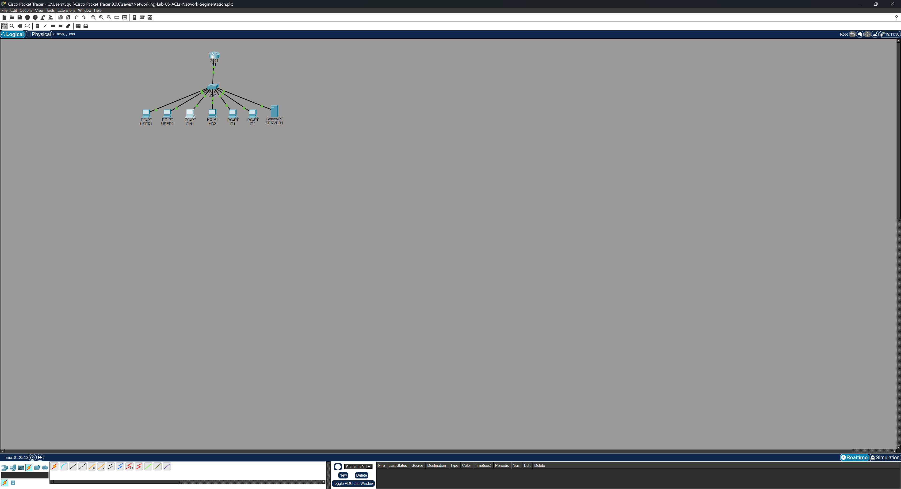
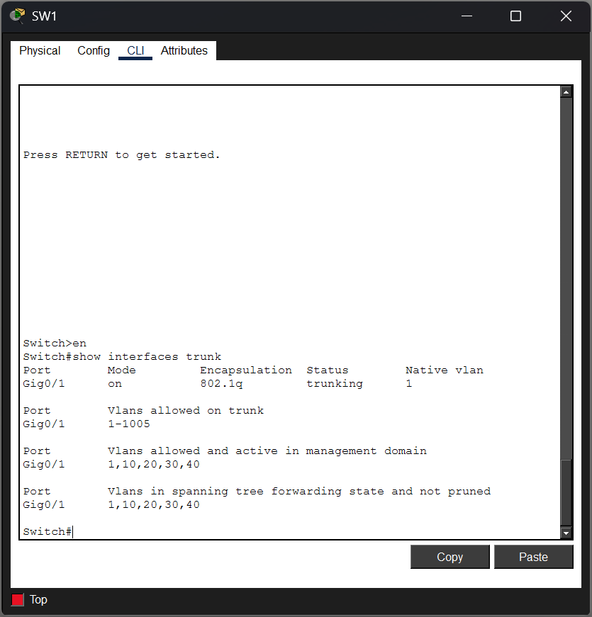
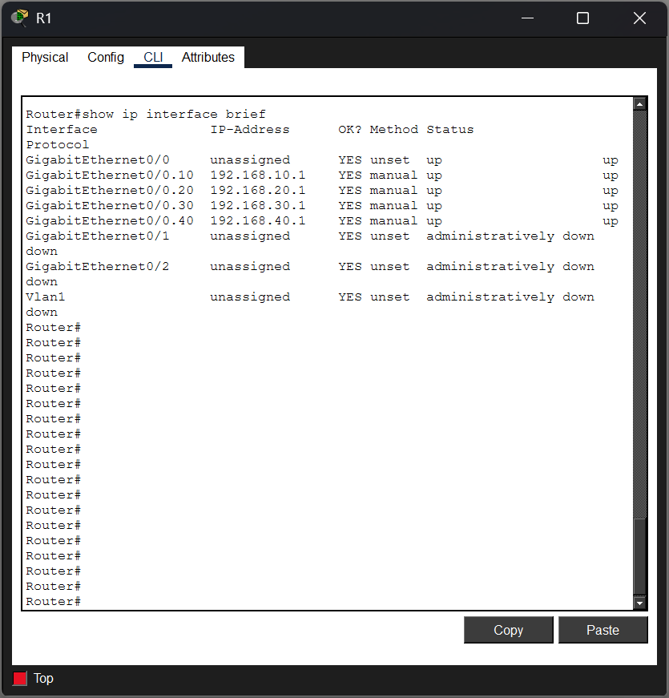
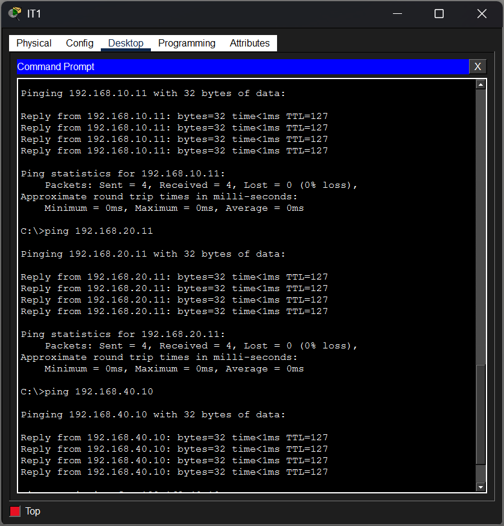
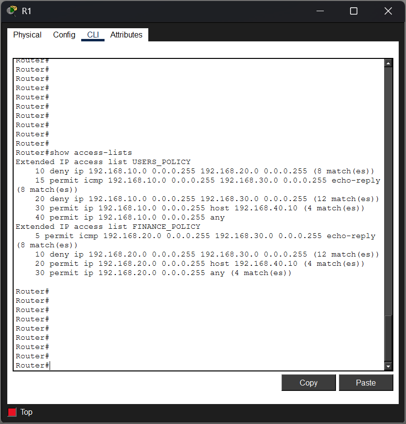
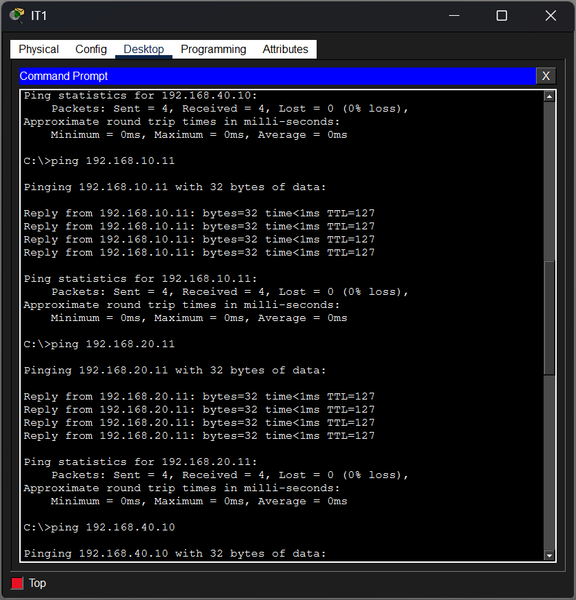

# Networking Lab #5 — ACLs & Network Segmentation

## Overview

This lab demonstrates network segmentation and traffic control using Cisco extended Access Control Lists (ACLs) in a multi-VLAN environment.

The network was configured with inter-VLAN connectivity using router-on-a-stick, and extended ACLs were implemented to enforce business security requirements between the USERS, FINANCE, IT, and SERVERS networks.

The lab also included troubleshooting an unintended connectivity issue caused by stateless ACL behavior and ACL rule ordering.

## Objectives

- Configure multiple VLANs and access ports
- Configure an 802.1Q trunk
- Configure router-on-a-stick inter-VLAN routing
- Establish and verify inter-VLAN connectivity
- Create named extended ACLs
- Apply ACLs close to the traffic source
- Control communication between network segments
- Understand ACL direction and rule ordering
- Understand the implicit deny
- Use ACL sequence numbers
- Verify ACL operation using match counters
- Troubleshoot ACL-related connectivity problems

## Network Topology

The topology consists of:

- 1 Cisco 2911 router
- 1 Cisco 2960 switch
- 6 client PCs
- 1 server

Four VLANs were used to separate network resources by business function.

| VLAN | Name | Network | Default Gateway |
|---|---|---|---|
| 10 | USERS | 192.168.10.0/24 | 192.168.10.1 |
| 20 | FINANCE | 192.168.20.0/24 | 192.168.20.1 |
| 30 | IT | 192.168.30.0/24 | 192.168.30.1 |
| 40 | SERVERS | 192.168.40.0/24 | 192.168.40.1 |

SERVER1 was configured with the IP address `192.168.40.10`.



## VLAN Configuration

The switch access ports were assigned as follows:

| Switch Port | Device | VLAN |
|---|---|---|
| Fa0/1 | USER1 | 10 |
| Fa0/2 | USER2 | 10 |
| Fa0/3 | FIN1 | 20 |
| Fa0/4 | FIN2 | 20 |
| Fa0/5 | IT1 | 30 |
| Fa0/6 | IT2 | 30 |
| Fa0/7 | SERVER1 | 40 |

SW1 GigabitEthernet0/1 was configured as an 802.1Q trunk to R1.

The VLAN and trunk configuration was verified before implementing traffic restrictions.



## Router-on-a-Stick

R1 used subinterfaces to provide Layer 3 routing between the VLANs.

```text
G0/0.10 → 192.168.10.1/24
G0/0.20 → 192.168.20.1/24
G0/0.30 → 192.168.30.1/24
G0/0.40 → 192.168.40.1/24
```

Each subinterface was configured with the corresponding 802.1Q VLAN tag.

```text
interface GigabitEthernet0/0.10
 encapsulation dot1Q 10
 ip address 192.168.10.1 255.255.255.0

interface GigabitEthernet0/0.20
 encapsulation dot1Q 20
 ip address 192.168.20.1 255.255.255.0

interface GigabitEthernet0/0.30
 encapsulation dot1Q 30
 ip address 192.168.30.1 255.255.255.0

interface GigabitEthernet0/0.40
 encapsulation dot1Q 40
 ip address 192.168.40.1 255.255.255.0
```



## Security Requirements

The following traffic policy was implemented:

- USERS may access SERVER1
- USERS may not initiate communication with FINANCE
- USERS may not initiate communication with IT
- FINANCE may access SERVER1
- FINANCE may not initiate communication with IT
- IT may access all networks
- Other permitted traffic should continue operating unless explicitly restricted

## Extended ACL Configuration

Named extended ACLs were used because the security policy required filtering based on both source and destination networks.

### USERS_POLICY

```text
ip access-list extended USERS_POLICY
 deny ip 192.168.10.0 0.0.0.255 192.168.20.0 0.0.0.255
 permit icmp 192.168.10.0 0.0.0.255 192.168.30.0 0.0.0.255 echo-reply
 deny ip 192.168.10.0 0.0.0.255 192.168.30.0 0.0.0.255
 permit ip 192.168.10.0 0.0.0.255 host 192.168.40.10
 permit ip 192.168.10.0 0.0.0.255 any
```

The ACL was applied inbound on the VLAN 10 router subinterface.

```text
interface GigabitEthernet0/0.10
 ip access-group USERS_POLICY in
```

### FINANCE_POLICY

```text
ip access-list extended FINANCE_POLICY
 permit icmp 192.168.20.0 0.0.0.255 192.168.30.0 0.0.0.255 echo-reply
 deny ip 192.168.20.0 0.0.0.255 192.168.30.0 0.0.0.255
 permit ip 192.168.20.0 0.0.0.255 host 192.168.40.10
 permit ip 192.168.20.0 0.0.0.255 any
```

The ACL was applied inbound on the VLAN 20 router subinterface.

```text
interface GigabitEthernet0/0.20
 ip access-group FINANCE_POLICY in
```

## Permitted Connectivity Verification

Connectivity testing was performed after ACL implementation to verify that authorized traffic continued to operate.

IT1 was able to communicate successfully with USER1, FIN1, and SERVER1 after the ACL policy was corrected.

This demonstrated that network segmentation could be enforced without preventing IT from accessing the networks it was authorized to reach.



## ACL Verification

ACL operation was verified using:

```text
show access-lists
show running-config
```

ACL match counters provided evidence that traffic was being evaluated by the expected permit and deny entries.

Final policy testing confirmed:

| Traffic | Result |
|---|---|
| USERS → FINANCE | Blocked |
| USERS → IT | Blocked |
| USERS → SERVER1 | Allowed |
| FINANCE → IT | Blocked |
| FINANCE → SERVER1 | Allowed |
| IT → USERS | Allowed |
| IT → FINANCE | Allowed |
| IT → SERVER1 | Allowed |



## Troubleshooting Scenario — IT Return Traffic Blocked

### Symptom

The security policy required IT to have access to all networks.

However, testing showed that IT1 could successfully reach SERVER1 but could not successfully ping USER1 or FIN1.

### Investigation

Connectivity testing showed:

```text
IT1 → SERVER1   SUCCESS
IT1 → USER1     FAILED
IT1 → FIN1      FAILED
```

The ACL configuration and match counters were examined using:

```text
show access-lists
```

During the failed tests, the deny counters for USERS-to-IT and FINANCE-to-IT increased.

This provided evidence that IT's ICMP echo requests were reaching the destination networks, but the returning ICMP echo replies were being blocked by the ACLs.

### Root Cause

The ACLs were stateless.

Although IT was allowed to initiate traffic toward USERS and FINANCE, the return packets were independently evaluated when they entered R1 from those VLANs.

The returning ICMP echo replies matched the broader deny statements toward the IT network and were dropped.

Conceptually:

```text
IT1 → USER1 echo request
        ↓
Request reaches USER1
        ↓
USER1 generates echo reply
        ↓
Reply enters R1 through VLAN 10
        ↓
USERS_POLICY evaluates packet
        ↓
USERS → IT deny matched
        ↓
Reply dropped
```

The same behavior occurred when IT1 communicated with FINANCE.

### Remediation

More-specific ICMP `echo-reply` permit statements were inserted before the broader deny statements using ACL sequence numbers.

For `USERS_POLICY`:

```text
15 permit icmp 192.168.10.0 0.0.0.255 192.168.30.0 0.0.0.255 echo-reply
```

For `FINANCE_POLICY`:

```text
5 permit icmp 192.168.20.0 0.0.0.255 192.168.30.0 0.0.0.255 echo-reply
```

Because ACLs are evaluated from top to bottom and processing stops at the first matching entry, the specific ICMP reply traffic is permitted before the broader IP deny is evaluated.

### Verification

After modifying the ACLs:

```text
IT1 → USER1     SUCCESS
IT1 → FIN1      SUCCESS
IT1 → SERVER1   SUCCESS

USER1 → IT1     BLOCKED
FIN1 → IT1      BLOCKED
```

This confirmed that the ACLs enforced the intended segmentation policy while allowing the required ICMP return traffic.



## Key Takeaways

- Standard ACLs primarily filter based on source addresses
- Extended ACLs can filter based on source, destination, protocol, and ports
- Extended ACLs are generally placed close to the traffic source
- ACL direction is determined from the router interface's perspective
- ACL entries are evaluated from top to bottom
- The first matching ACL entry determines the packet's action
- ACLs contain an implicit deny at the end
- More-specific rules should be placed before broader rules
- Traditional ACLs are stateless and do not automatically permit return traffic
- ACL sequence numbers allow rules to be inserted in the required order
- ACL match counters provide useful troubleshooting evidence
- Connectivity should be verified before and after security controls are implemented
- Troubleshooting should follow observed evidence rather than assumptions

## Skills Demonstrated

- Cisco IOS
- VLAN configuration
- 802.1Q trunking
- Router-on-a-stick
- IPv4 addressing
- Inter-VLAN routing
- Named extended ACLs
- ACL sequence numbers
- Wildcard masks
- Network segmentation
- Traffic filtering
- ICMP troubleshooting
- ACL verification
- Network troubleshooting

## Files

- `Networking-Lab-05-ACLs-Network-Segmentation.pkt` — Cisco Packet Tracer lab file
- `screenshots/` — Configuration, verification, and troubleshooting evidence
